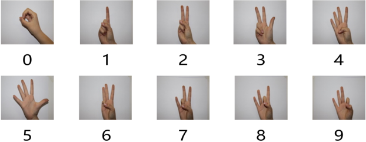
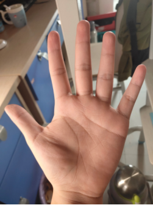
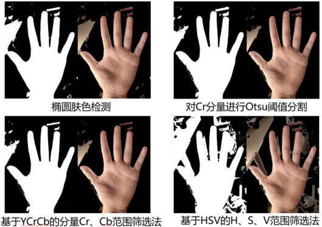
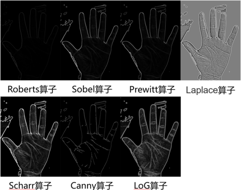
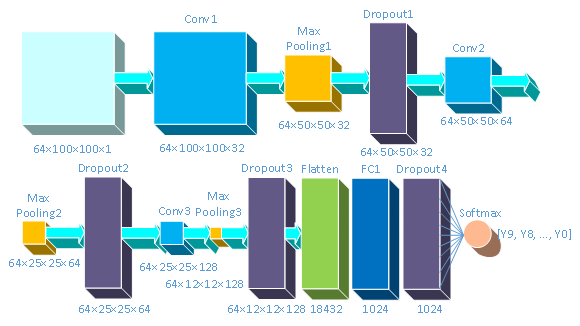
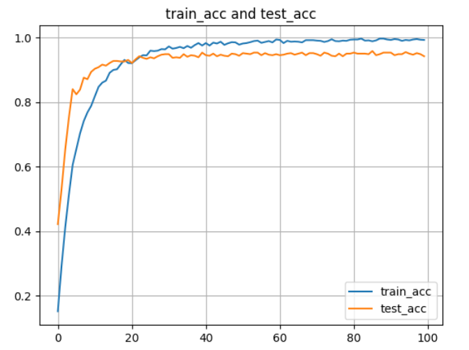
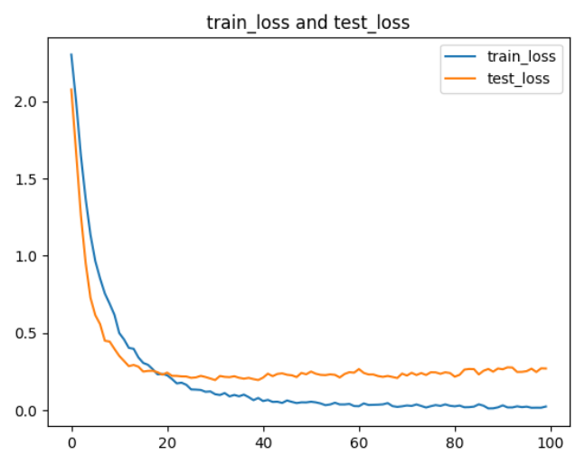
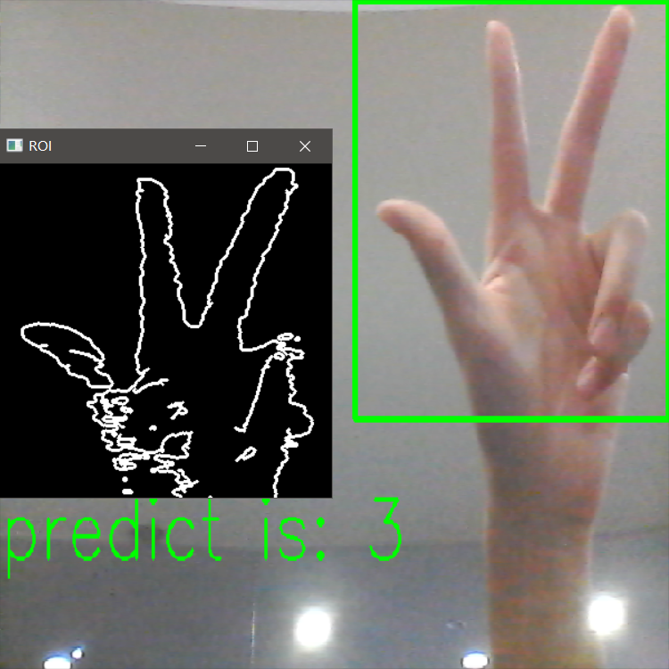
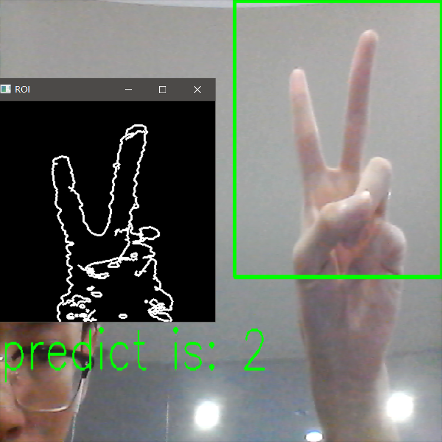
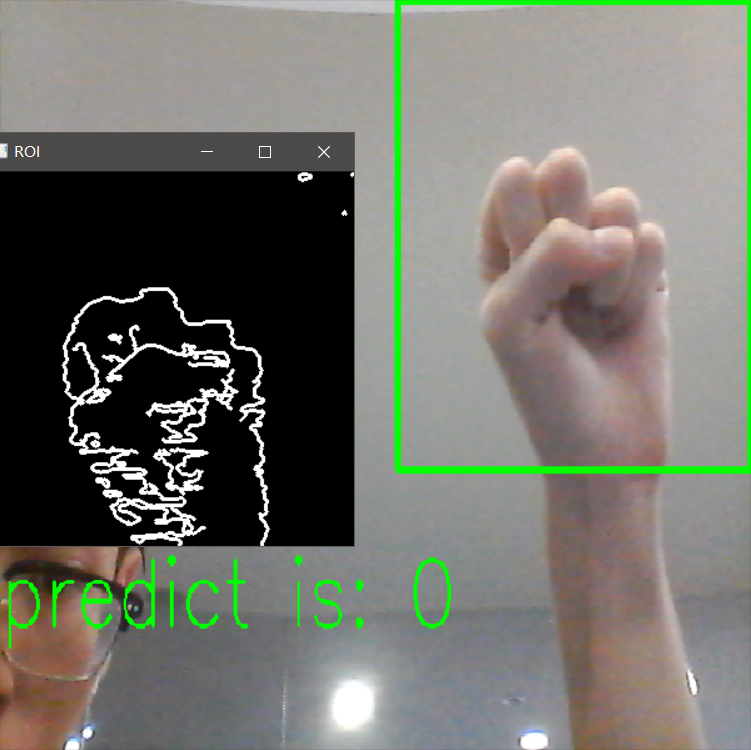

# Gesture-Recognition Lightweight CNN
CNN for static gesture recognition base on Computer Vision

## Dataset

Dataset from Ankara Ayranci Anadolu, Turkey, and 10 types of gestures in total.

## Data Processing

### Skin colour detection

A wide variety of skin colour detection algorithms, including elliptical skin colour detection models, Cr component of YCrCb colour space + Otsu threshold segmentation, YCrCb colour space based Cr, Cb range filtering method, HSV colour space based H, S, V range filtering method, etc. After testing, YCrCb + Otus has better result,  so YCrCb + Otus will be used in the following models.

### Edge detection

Comparison of the effects of seven different edge detection operators (Roberts, Sobel, Prewitt, Laplace, Scharr, Canny, LoG) after Otsu thresholding segmentation of the Cr component of YCrCb. In the following models, Canny will be used.

### Other image Processing

including image morphology adjustment, image smoothing, noise reduction etc.

## Lightweight CNN models

Based on LetNet-5, our lightweight CNN model has the following structure, it mainly contains 2 Convolutional layers and Max pooling layers, followed by 3 Dense layers. The Dropout layer is added to prevent overfitting of the model.

  

Part of result of different edge detection methods base on this CNN model:

|        methods         | traning set | testing set |
| :--------------------: | :---------: | :---------: |
| YCrCb + Otus & Roberts |   99.94%    |   93.22%    |
|  YCrCb + Otus & Sobel  |   99.62%    |   93.70%    |
| YCrCb + Otus & Prewitt |   99.54%    |   93.71%    |
|  YCrCb + Otus & Canny  |   99.27%    |   94.18%    |

After hyper-parameterisation, the final test set is accurate to **95.15%**.

    

## Document Intro

`capture_video.py`: run the program in real-time recognition  with `gesture_model.h5`

`run_model.py`: train the CNN model

